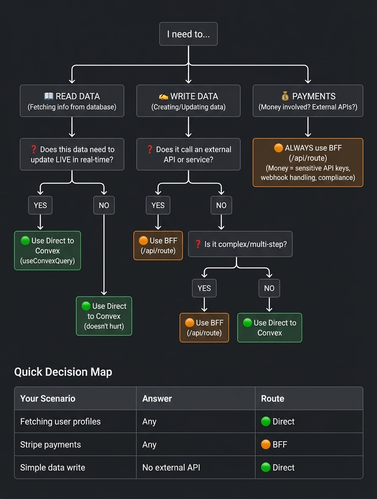
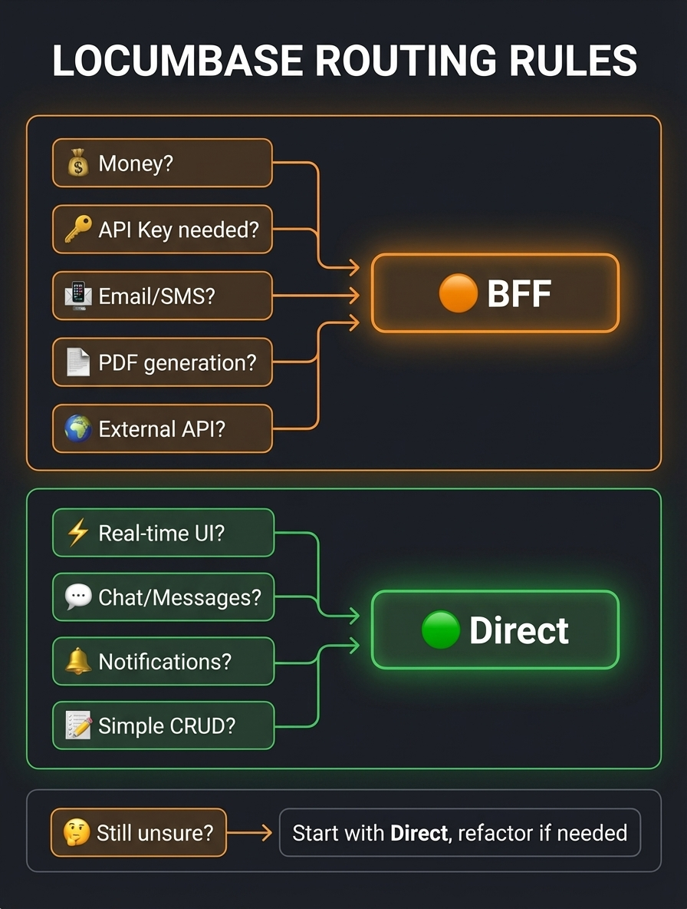

# 🧭 Convex Routing Guide

> **TL;DR:** Real-time stuff → Direct to Convex. Money & external APIs → Through Nuxt Server.

---

## 📖 Table of Contents

- [The Two Paths](#the-two-paths)
- [Decision Tree](#-decision-tree)
- [Golden Rules](#-the-golden-rules)
- [Quick Reference Table](#-quick-reference-table)
- [Examples by Feature](#-examples-by-feature)
- [Code Patterns](#-code-patterns)
- [Cheat Sheet](#-cheat-sheet)

---

## The Two Paths

```
┌─────────────────────────────────────────────────────────────────┐
│                                                                 │
│  🟢 PATH A: Direct to Convex                                   │
│  ═══════════════════════════════════════════════════════════   │
│                                                                 │
│  Browser ────────────────────────────────► Convex             │
│         useConvexQuery / useConvexMutation                     │
│                                                                 │
│  ✅ Real-time subscriptions                                    │
│  ✅ Optimistic updates                                         │
│  ✅ Minimal latency                                            │
│  ✅ Automatic caching                                          │
│                                                                 │
├─────────────────────────────────────────────────────────────────┤
│                                                                 │
│  🟠 PATH B: Through Nuxt Server (BFF)                          │
│  ════════════════════════════════════════════════════════════  │
│                                                                 │
│  Browser ────► /api/route ────► Convex                        │
│          │                          │                          │
│          ├──────────────────────► Stripe                       │
│          ├──────────────────────► SendGrid                     │
│          └──────────────────────► Gov License API             │
│                                                                 │
│  ✅ Full Node.js ecosystem                                     │
│  ✅ Sensitive API keys stay server-side                        │
│  ✅ Complex multi-step transactions                            │
│  ✅ Custom rate limiting & validation                          │
│                                                                 │
└─────────────────────────────────────────────────────────────────┘
```

---

## Decision Tree

### Quick Decision Map

Follow this flowchart to determine whether to use **Direct to Convex** or the **BFF** pattern:



| Your Scenario                 | Answer               | Route      |
| ----------------------------- | -------------------- | ---------- |
| Fetching user profiles        | Any                  | 🟢 Direct  |
| Real-time notifications       | Yes                  | 🟢 Direct  |
| Shift listings (live updates) | Yes                  | 🟢 Direct  |
| Messages/Chat                 | Any                  | 🟢 Direct  |
| User favorites                | Any                  | 🟢 Direct  |
| **Stripe payments**           | **Any**              | **🟠 BFF** |
| **License verification**      | **Has external API** | **🟠 BFF** |
| **Email/SMS sending**         | **Has external API** | **🟠 BFF** |
| Simple data write             | No external API      | 🟢 Direct  |

---

## 🎯 The Golden Rules

| Rule                | Description                                  |
| ------------------- | -------------------------------------------- |
| 💰 **Money Rule**   | If money moves → **BFF**                     |
| 🔑 **Secrets Rule** | If it needs an API key → **BFF**             |
| ⚡ **Live Rule**    | If the UI should auto-update → **Direct**    |
| 💬 **Chat Rule**    | If it's messaging/notifications → **Direct** |

---

## 📋 Quick Reference Table

### 🟢 Go Direct to Convex

| Feature               | Why Direct?                            |
| --------------------- | -------------------------------------- |
| Shift listings        | Real-time: new shifts appear instantly |
| Shift applications    | Pharmacy sees applications live        |
| Live activity feed    | "Sarah just logged a flu shot"         |
| Messages / Chat       | Instant delivery                       |
| Notifications         | Real-time badge updates                |
| User profile updates  | Simple CRUD                            |
| Favorites list        | Simple CRUD                            |
| Calendar availability | Simple CRUD                            |
| Shift status changes  | Real-time tracking                     |
| Reviews & ratings     | Simple write, live on profile          |

### 🟠 Go Through Nuxt Server (BFF)

| Feature                    | Why BFF?                         |
| -------------------------- | -------------------------------- |
| Stripe checkout            | Sensitive keys, webhook handling |
| Stripe Connect onboarding  | Multi-step OAuth flow            |
| Payout processing          | Financial transaction            |
| License verification       | External Gov API call            |
| Email notifications        | SendGrid/Resend API              |
| SMS alerts                 | Twilio API                       |
| PDF invoice generation     | Heavy processing                 |
| Document upload processing | Virus scanning, S3               |
| Subscription management    | Stripe Billing API               |
| Geocoding addresses        | Google Maps API                  |
| Background checks          | External service                 |

---

## 🏗️ Examples by Feature

### Example 1: Posting a Shift

**Q: Does it call external APIs?**  
A: No (just saving to DB)

**Q: Is it multi-step/complex?**  
A: No (single insert)

**Q: Does the listing need to appear instantly for locums?**  
A: YES!

✅ **Verdict: 🟢 DIRECT TO CONVEX**

```typescript
// composables/useShifts.ts
const createShift = useConvexMutation(api.shiftRequests.create);

await createShift({
  pharmacyId,
  date: "2025-01-10",
  startTime: "09:00",
  // ...
});
// All subscribed locums see it INSTANTLY ⚡
```

---

### Example 2: Checkout & Payment

**Q: Does it involve money?**  
A: YES 💰

✅ **Verdict: 🟠 BFF (No further questions needed)**

```typescript
// server/api/payments/checkout.post.ts
export default defineEventHandler(async (event) => {
  const body = await readBody(event);
  const convex = getConvexClient();

  // 1. Get shift details from Convex
  const shift = await convex.query(api.shiftRequests.get, { id: body.shiftId });

  // 2. Create Stripe PaymentIntent (SENSITIVE KEY)
  const stripe = new Stripe(process.env.STRIPE_SECRET_KEY);
  const paymentIntent = await stripe.paymentIntents.create({
    amount: shift.totalEstimatedPay * 100,
    currency: "gbp",
    metadata: { shiftId: body.shiftId },
  });

  // 3. Store invoice record in Convex
  await convex.mutation(api.invoices.create, {
    shiftRequestId: body.shiftId,
    stripePaymentIntentId: paymentIntent.id,
    status: "pending",
  });

  return { clientSecret: paymentIntent.client_secret };
});
```

---

### Example 3: Live Shift Tracking

**Q: Does it need to update live?**  
A: YES! Pharmacy watches locum's activity in real-time

✅ **Verdict: 🟢 DIRECT TO CONVEX**

```vue
<script setup lang="ts">
// This auto-updates when locum logs new activities!
const activities = useConvexQuery(api.shiftActivities.listByShift, {
  shiftId: currentShiftId,
});
</script>

<template>
  <div class="live-feed">
    <div v-for="activity in activities" :key="activity._id">
      {{ activity.actionName }} - {{ formatTime(activity.loggedAt) }}
    </div>
  </div>
</template>
```

---

### Example 4: License Verification

**Q: Does it call external APIs?**  
A: YES (Government pharmacy board API)

✅ **Verdict: 🟠 BFF**

```typescript
// server/api/verification/license.post.ts
export default defineEventHandler(async (event) => {
  const { registrationNumber, userId } = await readBody(event);
  const convex = getConvexClient();

  // 1. Call external verification API
  const verification = await $fetch("https://pharmacyboard.gov/api/verify", {
    method: "POST",
    headers: { "X-API-Key": process.env.PHARMACY_BOARD_API_KEY },
    body: { registrationNumber },
  });

  // 2. Update document status in Convex
  await convex.mutation(api.documents.updateStatus, {
    userId,
    type: "license_cert",
    status: verification.valid ? "verified" : "rejected",
    rejectionReason: verification.valid ? undefined : verification.reason,
  });

  return { verified: verification.valid };
});
```

---

## 🧩 Code Patterns

### Direct Convex (Client-Side)

```typescript
// ✅ Reading with real-time subscription
const shifts = useConvexQuery(api.shiftRequests.listOpen, { city: "London" });

// ✅ Writing with optimistic updates
const applyToShift = useConvexMutation(api.shiftApplications.create);
```

### BFF Pattern (Server Route)

```typescript
// server/api/[resource]/[action].post.ts
export default defineEventHandler(async (event) => {
  // 1. Validate & authenticate
  const session = await requireAuth(event);
  const body = await readBody(event);

  // 2. Business logic & external calls
  const externalResult = await callExternalApi(body);

  // 3. Persist to Convex
  const convex = getConvexClient();
  const result = await convex.mutation(api.resource.action, {
    ...body,
    externalRef: externalResult.id,
  });

  return { success: true, data: result };
});
```

---

## 🚦 Cheat Sheet

Copy this to your desk:



---

## 📚 Further Reading

- [Convex Documentation](https://docs.convex.dev)
- [Nuxt Server Routes](https://nuxt.com/docs/guide/directory-structure/server)

---

_Last updated: January 2026_
